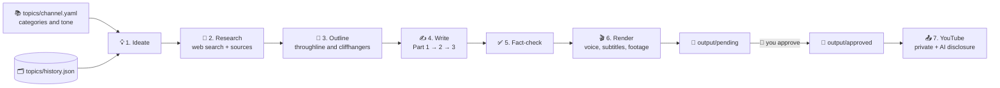

<div align="center">

# 🛡️ Plot Armor Facts

### Automated YouTube Shorts: researched stories → narrated videos → your approval → YouTube

<p>
  
  
  
  
  
  
</p>

**Plot Armor Facts** plans a fresh 3-part story series every day (true survival, nature, history and science stories), researches it on the web, writes and fact-checks the scripts, and renders them into vertical videos with voice-over, subtitles and stock footage.
**Nothing is uploaded until you approve it**, and every upload goes up **private** with the AI-content disclosure switched on.

[Features](#-features) •
[How it works](#-how-it-works) •
[Installation](#-installation) •
[Environment variables](#-environment-variables-env) •
[Get your keys](#-get-your-keys-step-by-step) •
[Usage](#-usage) •
[Troubleshooting](#-troubleshooting)

</div>

---

## 📑 Table of contents

1. [Features](#-features)
2. [How it works](#-how-it-works)
3. [Requirements](#-requirements)
4. [Installation](#-installation)
5. [Environment variables (.env)](#-environment-variables-env)
6. [Get your keys, step by step](#-get-your-keys-step-by-step)
7. [Usage](#-usage)
8. [Customize your channel](#-customize-your-channel)
9. [Limits and safety](#-limits-and-safety)
10. [Troubleshooting](#-troubleshooting)
11. [Project structure](#-project-structure)
12. [Developer reference](#-developer-reference)

---

## ✨ Features

| | Feature | What it does |
|:--:|---|---|
| 💡 | **Automatic topics** | The AI picks a new series idea every day from the categories you choose. |
| ☁️ | **GitHub Actions** | Runs daily in the cloud: renders, checks every video, waits for your approval, schedules the uploads. |
| 🎞️ | **Footage that matches** | One stock clip per ~8 spoken words, in script order, previewed before rendering with `footage storyboard`. |
| 🗓️ | **/plan-month** | A Claude Code command that researches, writes and checks next month's calendar for you. |
| 📅 | **Content calendar** | Or pre-write a whole month in `topics/calendar/`: the pipeline renders and schedules it and never invents a topic for those days. |
| 🚫 | **No repeats** | Every series is saved to `topics/history.json`, and new ideas that are too similar are rejected. |
| 🔎 | **Web research** | Facts are collected with web search, and each one comes with a source link. |
| 🧭 | **Real storytelling** | Each series is outlined first, then Part 1 → 2 → 3 are written with recaps and cliffhangers. |
| ✅ | **Fact-check** | Every claim is checked against the sourced facts. If the check fails, nothing is saved. |
| 🎙️ | **Free voice-over** | Natural Microsoft Edge voices (for example *Andrew Multilingual*), plus subtitles. |
| 🎬 | **Auto-edited video** | 9:16 videos built from Pexels stock footage that matches each part's mood. |
| 🙋 | **Human approval** | Videos wait in `output/pending/` until you approve them. |
| 📤 | **Safe uploads** | Private by default, AI disclosure on, and a hard cap of 5 uploads a day. |
| 🧪 | **Dry-run everything** | Every command supports `--dry-run`, which shows what would happen without calling any API. |

---

## 🧠 How it works



Every part ends with a call to action that the code adds itself, so the AI can't skip it:

| Part | Ending |
|---|---|
| Part 1 | *"Follow for Part 2."* |
| Part 2 | *"Follow for Part 3."* |
| Part 3 | *"Subscribe to Plot Armor Facts for more videos."* |

---

## 🧰 Requirements

| Tool | Why | Download |
|---|---|---|
| **Git** | Download the project | https://git-scm.com/downloads |
| **uv** | Installs Python 3.11 and all packages | https://docs.astral.sh/uv/getting-started/installation/ |
| **Docker Desktop** | Runs the video engine | https://www.docker.com/products/docker-desktop/ |
| **Ollama** *(optional)* | Free local AI, used for offline testing | https://ollama.com/download |
| **make** *(optional)* | Short commands like `make up` | Windows: `winget install ezwinports.make` |

> [!NOTE]
> You need about **8 GB of free RAM** and **15 GB of free disk space**. The first Docker build downloads about 3 GB.

---

## 🚀 Installation

### Step 1: Install the tools

<details>
<summary><b>🪟 Windows</b></summary>

1. Install **Git**: https://git-scm.com/download/win
2. Install **uv** (in PowerShell):
   ```powershell
   powershell -ExecutionPolicy ByPass -c "irm https://astral.sh/uv/install.ps1 | iex"
   ```
3. Install **Docker Desktop**: https://www.docker.com/products/docker-desktop/ and start it once.
4. *(Optional)* Install **make**:
   ```powershell
   winget install ezwinports.make
   ```
5. **Close and reopen your terminal** so the new commands are found.

</details>

<details>
<summary><b>🍎 macOS / 🐧 Linux</b></summary>

1. Install **Git** from your package manager.
2. Install **uv**:
   ```bash
   curl -LsSf https://astral.sh/uv/install.sh | sh
   ```
3. Install **Docker Desktop** (macOS) or **Docker Engine + Compose** (Linux): https://docs.docker.com/get-docker/
4. `make` is usually already installed.

</details>

### Step 2: Download the project

```bash
git clone https://github.com/ajmaladev/youtube-automations.git
cd youtube-automations
```

### Step 3: Install Python packages

```bash
uv sync
```

> [!TIP]
> `uv` downloads Python 3.11 automatically. You don't need to install Python yourself.

### Step 4: Download the video engine

The video engine is kept outside git and downloaded with one command. On Windows, run it from **Git Bash**:

```bash
make vendor
```

### Step 5: Create your config files

<table>
<tr><th>🪟 Windows (Command Prompt)</th><th>🍎 macOS / 🐧 Linux</th></tr>
<tr><td>

```bat
copy config\config.template.toml config\config.toml
copy config\env.example .env
mkdir .credentials
```

</td><td>

```bash
make setup
```

</td></tr>
</table>

### Step 6: Fill in `.env`

Open `.env` in any text editor and add your keys. The next section explains every variable, and [Get your keys](#-get-your-keys-step-by-step) shows how to create each one.

> [!CAUTION]
> `.env` holds your secrets. It is already in `.gitignore`. **Never commit it or share it.**

### Step 7: Start the video engine

Make sure **Docker Desktop is running**, then:

```bash
docker compose up -d --build
```

⏳ The first build takes 5–10 minutes. Later starts take seconds.

### Step 8: Check that it works

1. Open **http://127.0.0.1:8080/docs**, or use the port you set in `ENGINE_HOST_PORT`.
2. Log in with `BASIC_AUTH_USER` and your password.
3. You should see the engine's API page. 🎉

Then run the tests and a full dry run, which use no API calls or credits:

```bash
uv run pytest
uv run python -m orchestrator.scheduler --dry-run
```

---

## 🔐 Environment variables (`.env`)

**Legend:** 🔴 Required · 🟡 Required in some cases · 🟢 Optional (a default is used)

### 🎬 Video generation

| Variable | Need | Example / default | What it is |
|---|:--:|---|---|
| `PEXELS_API_KEY` | 🔴 | `563492ad6f9...` | Free stock-footage key. [How to get it](#1-pexels-api-key-stock-footage) |
| `LLM_PROVIDER` | 🟢 | `ollama` | AI the **video engine** uses for manual topics (`ollama` or `openai`) |
| `OLLAMA_HOST` | 🟡 | `http://host.docker.internal:11434` | Needed when `LLM_PROVIDER=ollama` |
| `OLLAMA_MODEL` | 🟢 | `llama3.1` | Any model shown by `ollama list` |
| `OPENAI_API_KEY` | 🟡 | `sk-...` | Only if `LLM_PROVIDER=openai` or `STORY_LLM_PROVIDER=openai` (paid) |
| `ELEVENLABS_API_KEY` | 🟢 | *(empty)* | Premium voices instead of the free Edge voices |

### 📅 Content calendar

| Variable | Need | Example / default | What it is |
|---|:--:|---|---|
| `CONTENT_CALENDAR_DIR` | 🟢 | `topics/calendar` | Folder with pre-written months (`YYYY-MM.json`) |
| `CALENDAR_LOOKAHEAD_DAYS` | 🟢 | `1` | Render episodes this many days early, so you can approve them in time |

### ✍️ Automatic story series

| Variable | Need | Example / default | What it is |
|---|:--:|---|---|
| `AUTO_SERIES` | 🟢 | `true` | Plan new series automatically when the manual queue is empty |
| `STORY_LLM_PROVIDER` | 🔴 | **`groq`** | AI that writes the stories: `groq`, `gemini`, `openai` or `ollama` |
| `GROQ_API_KEY` | 🟡 | `gsk_...` | Needed for `groq`. [How to get it](#2-groq-api-key-story-writing--research) |
| `STORY_LLM_MODEL` | 🟢 | `openai/gpt-oss-20b` | Writer model (leave empty for the default) |
| `STORY_RESEARCH_MODEL` | 🟢 | `openai/gpt-oss-120b` | Web-search research model (`off` disables research) |
| `STORY_ALLOW_UNVERIFIED` | 🟢 | `false` | `true` allows series without web research. **Testing only** |
| `GEMINI_API_KEY` | 🟡 | `AIza...` | Only if `STORY_LLM_PROVIDER=gemini` |

> [!IMPORTANT]
> Set `STORY_LLM_PROVIDER=groq`. Only Groq has built-in **web research**. With the other providers, planning stops with *"no web research available"*, because the AI would otherwise invent its own facts.

### 🔒 Video engine access and security

| Variable | Need | Example / default | What it is |
|---|:--:|---|---|
| `BASIC_AUTH_USER` | 🔴 | `admin` | Username for the engine's pages |
| `BASIC_AUTH_HASH` | 🔴 | `'$2a$14$Avd...'` | Encrypted password. **Keep the single quotes.** [How](#4-password-hash-basic_auth_hash) |
| `BASIC_AUTH_PASSWORD` | 🔴 | `MyStr0ngPass` | The same password in plain text (used by the scripts) |
| `ENGINE_API_KEY` | 🟢 | `x9Kq...` | Extra API protection. [How](#5-engine-api-key-optional) |
| `ENGINE_BASE_URL` | 🟢 | `http://127.0.0.1:8080` | Where the scripts reach the engine |
| `ENGINE_HOST_PORT` | 🟢 | `8080` | Change it (for example to `8081`) if the port is busy, and update `ENGINE_BASE_URL` to match |
| `WEBUI_HOST_PORT` | 🟢 | `8501` | Port for the engine's web interface |
| `BIND_ADDR` | 🟢 | `127.0.0.1` | Keep `127.0.0.1` so only your computer can access it |

### 📤 YouTube upload

| Variable | Need | Example / default | What it is |
|---|:--:|---|---|
| `YOUTUBE_CLIENT_SECRETS_PATH` | 🔴 | `.credentials/client_secret.json` | Google OAuth file. [How to get it](#6-youtube-upload-access-google-cloud) |
| `YOUTUBE_MAX_UPLOADS_PER_DAY` | 🟢 | `5` | Daily upload cap (5 at most) |
| `YOUTUBE_DAILY_QUOTA_UNITS` | 🟢 | `10000` | Google's free daily API quota |
| `YOUTUBE_UPLOAD_UNIT_COST` | 🟢 | `1600` | Conservative estimated cost per upload |
| `YOUTUBE_SCHEDULE_PUBLISH` | 🟢 | `false` | `true` = approved calendar episodes are scheduled for their slot, and YouTube publishes them then |

### ⏰ Scheduling

| Variable | Need | Example / default | What it is |
|---|:--:|---|---|
| `DAILY_GENERATE_COUNT` | 🟢 | `3` | Videos per daily run (3 = one full series) |
| `ENGINE_POLL_INTERVAL_S` | 🟢 | `10` | Seconds between progress checks |
| `ENGINE_GENERATE_TIMEOUT_S` | 🟢 | `1800` | Give up on a render after this many seconds |
| `GENERATE_ATTEMPTS` | 🟢 | `3` | Tries per video; the last try widens the stock-footage search |
| `GENERATE_RETRY_DELAY_S` | 🟢 | `30` | Seconds to wait between tries |
| `VERIFY_VIDEOS` | 🟢 | `true` | Check every MP4 (complete, 1080×1920, has narration, sensible length) before review |

<details>
<summary><b>⚙️ Advanced variables (you normally don't need these)</b></summary>

| Variable | Default | What it is |
|---|---|---|
| `STORY_LLM_BASE_URL` | provider default | Custom OpenAI-compatible endpoint |
| `OUTPUT_DIR` | `output` | Where videos and state files are stored |
| `CREDENTIALS_DIR` | `.credentials` | Where the YouTube login token is saved |
| `TOPIC_QUEUE_PATH` | `topics/queue.yaml` | Manual topic list |
| `CHANNEL_CONFIG_PATH` | `topics/channel.yaml` | Channel settings |
| `STORY_HISTORY_PATH` | `topics/history.json` | List of past series |

</details>

### 📋 Minimal working `.env`

```ini
PEXELS_API_KEY=your-pexels-key
LLM_PROVIDER=ollama
OLLAMA_HOST=http://host.docker.internal:11434

STORY_LLM_PROVIDER=groq
GROQ_API_KEY=your-groq-key

BASIC_AUTH_USER=admin
BASIC_AUTH_HASH='paste-your-hash-here'
BASIC_AUTH_PASSWORD=your-password

YOUTUBE_CLIENT_SECRETS_PATH=.credentials/client_secret.json
DAILY_GENERATE_COUNT=3
```

---

## 🔑 Get your keys, step by step

<a id="1-pexels-api-key-stock-footage"></a>

<details>
<summary><h3>1. Pexels API key (stock footage)</h3></summary>

> 💰 **Free**, no credit card needed.

1. Go to **https://www.pexels.com/join/** and create an account (or log in).
2. Open **https://www.pexels.com/api/** and click **"Your API Key"**.
3. Fill in the short form:
   - **Project name:** `Plot Armor Facts`
   - **Category:** `AI`
   - **Description:** *Automated educational YouTube Shorts using Pexels stock videos, credited in each video description.*
4. Tick **I agree to the Terms**, then click **Generate API Key**.
5. Copy the key into `.env`:
   ```ini
   PEXELS_API_KEY=your-key-here
   ```

</details>

<a id="2-groq-api-key-story-writing--research"></a>

<details>
<summary><h3>2. Groq API key (story writing and research)</h3></summary>

> 💰 **Free tier**: about 200,000 tokens a day per model. One full series uses roughly 40–50k.

1. Go to **https://console.groq.com** and sign in with Google or GitHub.
2. Open **https://console.groq.com/keys**.
3. Click **Create API Key**, name it `plot-armor-facts`, then click **Submit**.
4. **Copy the key right away**, because it is shown only once.
5. Add it to `.env`:
   ```ini
   STORY_LLM_PROVIDER=groq
   GROQ_API_KEY=gsk_your-key-here
   ```
6. *(Optional)* Check your limits at **https://console.groq.com/settings/limits**.

</details>

<a id="3-ollama-free-local-ai"></a>

<details>
<summary><h3>3. Ollama (free local AI)</h3></summary>

> 💰 **Free**, runs on your own computer.

1. Download and install it from **https://ollama.com/download**.
2. Open a **new** terminal and download a model (about 4.9 GB):
   ```bash
   ollama pull llama3.1
   ```
3. Test it:
   ```bash
   ollama run llama3.1 "Say hello in one sentence."
   ```
4. Keep Ollama running in the system tray. `.env` already points to it:
   ```ini
   LLM_PROVIDER=ollama
   OLLAMA_HOST=http://host.docker.internal:11434
   OLLAMA_MODEL=llama3.1
   ```

</details>

<a id="4-password-hash-basic_auth_hash"></a>

<details>
<summary><h3>4. Password hash (<code>BASIC_AUTH_HASH</code>)</h3></summary>

The engine's pages are protected by a password. Caddy stores it as a secure hash.

1. Start **Docker Desktop**.
2. Run:
   ```bash
   docker run --rm -it caddy:2-alpine caddy hash-password
   ```
3. Type your password twice. The characters don't show while you type; that's normal.
4. Copy the output, which starts with `$2a$14$`, into `.env` **inside single quotes**:
   ```ini
   BASIC_AUTH_USER=admin
   BASIC_AUTH_HASH='$2a$14$your-hash'
   BASIC_AUTH_PASSWORD=the-password-you-typed
   ```

> [!WARNING]
> Without the single quotes, Docker misreads the `$` signs and you'll see *"variable is not set"* warnings.

</details>

<a id="5-engine-api-key-optional"></a>

<details>
<summary><h3>5. Engine API key (optional)</h3></summary>

This adds a second lock on the engine's API. Generate any long random string:

```bash
uv run python -c "import secrets; print(secrets.token_urlsafe(32))"
```

```ini
ENGINE_API_KEY=the-generated-string
```

</details>

<a id="6-youtube-upload-access-google-cloud"></a>

<details>
<summary><h3>6. YouTube upload access (Google Cloud)</h3></summary>

> 💰 **Free**, no billing account needed.

**A. Create a project**
1. Open **https://console.cloud.google.com/projectcreate**.
2. Name it `plot-armor-facts`, then click **Create**.

**B. Enable the YouTube API**
1. Open **https://console.cloud.google.com/apis/library/youtube.googleapis.com**.
2. Make sure your new project is selected at the top, then click **Enable**.

**C. Set up the consent screen**
1. Open **https://console.cloud.google.com/auth/overview** and click **Get started**.
2. **App name:** `Plot Armor Facts`. **Support email:** your email.
3. **Audience:** choose **External**.
4. Add your contact email, accept the policy, then click **Create**.

**D. Add the upload permission**
1. Open **https://console.cloud.google.com/auth/scopes**.
2. Click **Add or remove scopes** and add `https://www.googleapis.com/auth/youtube.upload`.
3. Click **Update**, then **Save**.

**E. Publish the app** ⚠️ *very important*
1. Open **https://console.cloud.google.com/auth/audience**.
2. Click **Publish app** so the status becomes **In production**.

> [!WARNING]
> If the app stays in **Testing**, your YouTube login **expires every 7 days** and daily uploads stop working.

**F. Create the desktop client**
1. Open **https://console.cloud.google.com/auth/clients**.
2. Click **Create client**, set **Application type** to **Desktop app**, name it `plot-armor-desktop`, then click **Create**.
3. Click **Download JSON**.
4. Rename the file to `client_secret.json` and move it into the project's `.credentials/` folder.
5. Check `.env`:
   ```ini
   YOUTUBE_CLIENT_SECRETS_PATH=.credentials/client_secret.json
   ```

**G. Verify your YouTube channel**
- Verify your phone number at **https://www.youtube.com/verify** to unlock higher upload limits.

**H. Request the API audit** *(needed to publish publicly)*
- Fill in **https://support.google.com/youtube/contact/yt_api_form**.

> [!CAUTION]
> Until Google approves the audit, videos uploaded through the API are **locked to private**, and there is no appeal for videos uploaded before approval.

**I. First login**
- When you run `upload --auth-only`, Google may show *"Google hasn't verified this app"*. It's your own app, so click **Advanced → Go to Plot Armor Facts**.

</details>

<a id="7-optional-keys"></a>

<details>
<summary><h3>7. Optional keys (Gemini, OpenAI, ElevenLabs)</h3></summary>

| Service | Cost | Where to create the key | `.env` variable |
|---|---|---|---|
| Google Gemini | Free tier | https://aistudio.google.com/app/apikey | `GEMINI_API_KEY` |
| OpenAI | Paid | https://platform.openai.com/api-keys | `OPENAI_API_KEY` |
| ElevenLabs | Free trial; paid plan for commercial use | https://elevenlabs.io/app/settings/api-keys | `ELEVENLABS_API_KEY` |

</details>

---

## 🎮 Usage

> [!TIP]
> Add `--dry-run` to any command to see what it **would** do, without API calls, credits or uploads.

### Step 1: Start everything

1. Open **Docker Desktop** and wait until it shows *Engine running*.
2. *(Optional)* Start **Ollama**.
3. Start the video engine:
   ```bash
   docker compose up -d
   ```

### Step 2: Check today's content

If `topics/calendar/` has a file for this month (for example `2026-10.json`), the stories are already written:

```bash
uv run python -m orchestrator.content_calendar validate
uv run python -m orchestrator.content_calendar show --date 2026-10-01
```

For days the calendar doesn't cover, plan a new series instead:

```bash
uv run python -m orchestrator.story plan
```

This prints the 3 scripts with their word counts and saves them to `output/series/<series-id>.json`, together with the facts, sources and fact-check report.

### Step 3: Render the videos

```bash
uv run python -m orchestrator.generate --count 3
```

- Each video takes about 2–4 minutes.
- Finished videos appear in **`output/pending/`**.
- To render one specific part: `--topic <series-id>-p1`.

> [!NOTE]
> Order: topics you add by hand in `topics/queue.yaml`, then calendar episodes (up to `CALENDAR_LOOKAHEAD_DAYS` ahead), then automatic series.

### Step 4: Review and approve

```bash
uv run python -m orchestrator.review list
uv run python -m orchestrator.review show <id>
```

Watch the `.mp4` in `output/pending/`, then decide:

```bash
uv run python -m orchestrator.review approve <id>
uv run python -m orchestrator.review reject <id>
```

### Step 5: Connect YouTube (one time only)

```bash
uv run python -m orchestrator.upload --auth-only
```

Your browser opens so you can log in, and the login is saved to `.credentials/youtube.token.json`.

### Step 6: Upload

```bash
uv run python -m orchestrator.upload
```

- Uploads everything in `output/approved/`, up to 5 a day.
- Videos go up **private** with the AI disclosure on.
- Uploaded videos move to `output/uploaded/`, and each one's `.json` file records its YouTube ID.
- Calendar episodes: with `YOUTUBE_SCHEDULE_PUBLISH=true` they are scheduled for their slot automatically (p1 morning, p2 afternoon, p3 night). Otherwise, in **YouTube Studio**, open each video, choose **Visibility → Schedule**, and pick a time.

### Step 7: Automate it daily

The daily run plans or renders videos, then uploads anything you've approved:

```bash
uv run python -m orchestrator.scheduler
```

<details>
<summary><b>🪟 Windows Task Scheduler (every day at 09:00)</b></summary>

```bat
schtasks /Create /SC DAILY /ST 09:00 /TN "PlotArmorFacts" /TR "cmd /c cd /d C:\path\to\youtube-automations && uv run python -m orchestrator.scheduler >> output\daily.log 2>&1"
```

Your PC must be on, with Docker Desktop running, at that time.

</details>

<details>
<summary><b>🍎 macOS / 🐧 Linux cron (every day at 09:00)</b></summary>

```cron
0 9 * * * cd /path/to/youtube-automations && uv run python -m orchestrator.scheduler >> output/daily.log 2>&1
```

</details>

### Step 8: Run it on GitHub Actions (optional)

`.github/workflows/daily-shorts.yml` runs every day at 16:00 UTC:

1. **Render:** runs the tests and calendar checks, starts the video engine (pinned version, cached in GitHub's container registry), renders tomorrow's 3 episodes, checks every MP4, and retries a failed render up to 3 times.
2. **Approve:** the run waits on the `youtube` environment. Download the `shorts-<date>` artifact from the run page, watch the videos, then click **Review deployments → Approve**.
3. **Upload:** uploads them private with scheduled publish times (09:00, 15:00 and 21:00 in the calendar's timezone), and records every upload on the `automation-state` branch so a re-run never posts twice.

One-time setup:

1. Create the YouTube login token on your computer:
   ```bash
   uv run python -m orchestrator.upload --auth-only
   ```
2. Add the repository secrets (**Settings → Secrets and variables → Actions**), or with the GitHub CLI as the repository owner:
   ```bash
   gh secret set PEXELS_API_KEY
   gh secret set YOUTUBE_CLIENT_SECRET_JSON < .credentials/client_secret.json
   gh secret set YOUTUBE_TOKEN_JSON < .credentials/youtube.token.json
   ```
3. **Settings → Environments → New environment** named `youtube`, and add yourself under **Required reviewers**. Without a reviewer, uploads start as soon as the render finishes.
4. *(Optional)* Add a repository variable `CALENDAR_TIMEZONE` if your calendar's `timezone` isn't `Europe/London`.
5. Test it: **Actions → Daily Shorts → Run workflow**, with a date such as `2026-10-01`.

> [!IMPORTANT]
> - Set the Google OAuth consent screen to **In production**, or the `YOUTUBE_TOKEN_JSON` login expires after 7 days.
> - YouTube keeps videos uploaded by **unverified API projects private**, even with a scheduled time. Request a YouTube API audit in Google Cloud so they can go public.
> - GitHub pauses scheduled workflows in public repositories after 60 days without activity. Re-enable it on the **Actions** tab if that happens.
> - Add next month's `topics/calendar/YYYY-MM.json` before the month starts; days without a calendar are skipped with a warning.

### ⚡ Command cheat sheet

| Task | Command | With `make` |
|---|---|---|
| Plan a series | `uv run python -m orchestrator.story plan` | – |
| List past series | `uv run python -m orchestrator.story history` | – |
| Check the calendar | `uv run python -m orchestrator.content_calendar validate` | `make calendar` |
| Preview every clip (waits for the Pexels limit) | `uv run python -m orchestrator.footage warm topics/calendar/2026-10.json` | – |
| Preview footage per sentence | `uv run python -m orchestrator.footage storyboard topics/calendar/2026-10.json` | – |
| Write next month | `/plan-month 2026-11` in Claude Code | – |
| Show a calendar day | `uv run python -m orchestrator.content_calendar show --date 2026-10-01` | – |
| Render videos | `uv run python -m orchestrator.generate --count 3` | `make generate` |
| Review | `uv run python -m orchestrator.review list` | `make review` |
| YouTube login | `uv run python -m orchestrator.upload --auth-only` | `make auth` |
| Upload | `uv run python -m orchestrator.upload` | `make upload` |
| Daily run | `uv run python -m orchestrator.scheduler` | `make daily` |
| Start / stop engine | `docker compose up -d` / `docker compose down` | `make up` / `make down` |
| Engine logs | `docker compose logs -f` | `make logs` |
| Run tests | `uv run pytest` | `make test` |

---

## 🎨 Customize your channel

### `topics/channel.yaml`: your channel's personality

```yaml
channel_name: "Plot Armor Facts"
episodes_per_series: 3
words_per_episode: [90, 130]      # ~35-50 seconds per part
tone: "fast, punchy and curious"
categories:
  - name: nature                  # higher weight = picked more often
    weight: 3
    brief: "Real animal and nature stories with a surprising twist."
  - name: adventure
    weight: 2
    brief: "True survival, rescue and exploration stories."
```

### `topics/calendar/YYYY-MM.json`: a pre-written month

One file per month with one 3-part series per day. The full format is in `topics/calendar/calendar.schema.json`:

```json
{
  "month": "2026-10",
  "timezone": "local",
  "slots": {"p1": {"label": "morning", "time": "09:00"}, "p2": {"label": "afternoon", "time": "15:00"},
            "p3": {"label": "night", "time": "21:00"}},
  "series": [{
    "series_id": "2026-10-01-hachiko", "date": "2026-10-01", "category": "nature",
    "series_title": "The Dog Who Never Stopped Waiting",
    "sources": [{"title": "Hachikō - Wikipedia", "url": "https://en.wikipedia.org/wiki/Hachik%C5%8D"}],
    "episodes": [{"episode_id": "2026-10-01-hachiko-p1", "part": "p1", "slot": "morning",
                  "script": "This dog waited for his dead owner for almost ten years. ...",
                  "video_terms": ["akita dog close up", "tokyo train station", "..."]}]
  }]
}
```

`make calendar` checks every month against the editorial rules before anything is rendered:

| Rule | Why |
|---|---|
| 80–110 words per part, including the ending | About 35–45 seconds keeps viewers to the end |
| Hook of 12 words at most, never opening with a date | The first second decides the swipe |
| Parts 2 and 3 recap in sentence 2 (`In Part 1, ...`) | Viewers who land on a later part can still follow |
| Specific cliffhangers, never "What happened next?" | A real reason to watch the next part |
| Endings: *"Subscribe so you don't miss Part 2."* / *"...Part 3."* / *"Subscribe for a new true story every day."* | One clear call to action |
| At most 4 numbers, and 24 words per sentence | Easy to follow by ear |
| 5 stock-footage terms, no characters, films, brands or comic art | Copyright-safe visuals |
| Sources for every series | Facts only |

### Next month's calendar: `/plan-month`

In Claude Code, run:

```text
/plan-month 2026-11
```

It lists the stories already used, picks filmable true stories (checking their key scenes on Pexels), sends batches to the `calendar-series-writer` agent to research and write them with sources, previews the clip under every sentence, then assembles and validates `topics/calendar/2026-11.json`. The rules live in `.claude/skills/calendar-writing/SKILL.md`. It never commits.

Check footage yourself at any time:

```bash
uv run python -m orchestrator.footage search "sled dogs running in snow"
uv run python -m orchestrator.footage storyboard topics/calendar/2026-10.json --date 2026-10-23
```

`storyboard` prints the exact Pexels clip the engine will pick for each term, next to the words it plays under. `/plan-month` always finishes with a full preview; to preview a file yourself (it waits out Pexels' 200-searches-an-hour limit):

```bash
uv run python -m orchestrator.footage warm topics/calendar/2026-10.json
```

### `topics/queue.yaml`: voice, style and manual topics

```yaml
defaults:
  voice_name: "en-US-AndrewMultilingualNeural-Male"   # natural free voice
  video_aspect: "9:16"
  category_id: "27"                                    # 27 = Education

topics:                          # optional: runs before automatic series
  - id: spider-silk-vs-steel
    subject: "Is real spider silk stronger than steel?"
    video_terms: "spider web dew, steel cable, laboratory"
```

<details>
<summary><b>🎙️ More free natural voices</b></summary>

| Voice | Style |
|---|---|
| `en-US-AndrewMultilingualNeural-Male` | Warm, confident narrator ⭐ |
| `en-US-BrianMultilingualNeural-Male` | Casual, friendly |
| `en-US-AvaMultilingualNeural-Female` | Bright, expressive |
| `en-US-EmmaMultilingualNeural-Female` | Clear, cheerful |

</details>

---

## 🛡️ Limits and safety

| Limit | Value | Notes |
|---|---|---|
| YouTube uploads | **5 per day** | Hard-capped in code |
| YouTube privacy | **Private** | `public` is refused; publish in YouTube Studio, or set `YOUTUBE_SCHEDULE_PUBLISH=true` to schedule approved calendar episodes |
| AI disclosure | **Always on** | `containsSyntheticMedia: true` |
| Groq free tier | ~200k tokens per model per day | Research uses ~30k per series |
| Pexels free tier | ~200 requests per hour | Plenty for daily videos |

> [!IMPORTANT]
> **Copyright:** never add official Marvel/DC art, movie clips, comic panels or logos. The pipeline uses only Pexels stock footage and your own narration. The bundled background songs were removed because of copyright risk.

---

## 🩺 Troubleshooting

| Problem | Fix |
|---|---|
| `'make' is not recognized` | Reopen the terminal after installing, use **Git Bash**, or run the `uv run ...` command instead |
| `'ollama' is not recognized` | Reopen the terminal, or use `"%LOCALAPPDATA%\Programs\Ollama\ollama.exe"` |
| `open //./pipe/dockerDesktopLinuxEngine` | Start **Docker Desktop** and wait for *Engine running* |
| Docker Desktop: *"Inference manager … file cannot be accessed"* | Click **Quit**, run `wsl --shutdown`, start Docker again, and turn off *Settings → AI → Docker Model Runner* |
| `ports are not available … 8080` | Another app uses the port. Set `ENGINE_HOST_PORT=8081` and `ENGINE_BASE_URL=http://127.0.0.1:8081` |
| `The "Avd" variable is not set` | Put single quotes around `BASIC_AUTH_HASH='...'` |
| `Connection refused` on generate | Run `docker compose ps`. The caddy container must be *Up*. |
| `groq HTTP 429 … tokens per day` | Groq's free daily limit is reached. Try again later or tomorrow. |
| `model ... does not exist` | Groq retired the model. Set a current one in `STORY_LLM_MODEL` (see https://console.groq.com/docs/models) |
| `no web research available` | Set `STORY_LLM_PROVIDER=groq` in `.env` |
| `draft rejected (... words)` | The AI wrote the wrong length. It retries automatically; Groq models do this far less often than Ollama. |
| Video voice sounds robotic | Use a *Multilingual* voice from [Customize your channel](#-customize-your-channel) |
| YouTube login expires after 7 days | Publish the consent screen (**In production**). See [Google Cloud step E](#6-youtube-upload-access-google-cloud) |

---

## 🗂️ Project structure

```text
youtube-automations/
├── 📁 orchestrator/            # the pipeline (Python)
│   ├── content_calendar.py     #   pre-written months: validate, load, schedule
│   ├── story.py                #   ideate → research → outline → write → fact-check
│   ├── llm.py                  #   Groq / Gemini / OpenAI / Ollama client
│   ├── generate.py             #   sends scripts to the video engine, downloads videos
│   ├── video_check.py          #   checks every rendered MP4 before review
│   ├── footage.py              #   previews the Pexels clip under every sentence
│   ├── review.py               #   approval gate (pending → approved)
│   ├── upload.py               #   YouTube OAuth, resumable upload, quota
│   ├── scheduler.py            #   daily run
│   ├── config.py               #   reads and validates .env
│   ├── models.py               #   data classes
│   └── render_config.py        #   fills engine config at container start
├── 📁 topics/
│   ├── channel.yaml            # ✏️ channel personality and categories
│   ├── queue.yaml              # ✏️ voice, style, manual topics
│   ├── calendar/               # ✏️ pre-written months (YYYY-MM.json) + schema
│   └── history.json            # every series ever planned (no repeats)
├── 📁 config/
│   ├── env.example             # template for .env
│   └── config.template.toml    # engine config with ${VARIABLE} placeholders
├── 📁 deploy/
│   ├── Caddyfile               # password protection
│   ├── engine.Dockerfile       # engine image
│   ├── engine.ref              # pinned upstream engine commit
│   └── engine.patch            # this project's engine changes (karaoke subtitles)
├── 📁 scripts/ci/              # vendor/build/start the engine + upload history, used by GitHub Actions
├── 📁 .github/workflows/       # daily-shorts.yml: render → approve → upload
├── 📁 .claude/                 # /plan-month skill, calendar-writing rules, calendar-series-writer agent
├── 📁 tests/                   # offline tests (no network)
├── 📁 output/                  # 🚫 gitignored: series/, pending/, approved/, uploaded/
├── 📁 vendor/video-engine/     # 🚫 gitignored: downloaded by `make vendor`
├── 📁 .credentials/            # 🚫 gitignored: Google OAuth files
├── docker-compose.yml
├── Makefile
└── .env                        # 🚫 gitignored: your secrets
```

---

## 👩‍💻 Developer reference

<details>
<summary><b>🧪 Tests</b></summary>

```bash
uv run pytest
```

- All network access is blocked in tests, and every external API is mocked.
- No `.env` or credentials are needed.

</details>

<details>
<summary><b>🔌 Video engine REST API</b></summary>

All routes are under `/api/v1`. If `ENGINE_API_KEY` is set, every request needs an `x-api-key` header. API docs are at `/docs`, and the health check is `GET /ping` → `"pong"`.

**Create a video: `POST /api/v1/videos`**

| Field | Type / default | Notes |
|---|---|---|
| `video_subject` | string, **required** | Topic |
| `video_script` | string `""` | The pipeline sends the finished script, so the engine's own AI is skipped |
| `video_terms` | string or list | Stock-footage search terms |
| `video_aspect` | `"9:16"` / `"16:9"` / `"1:1"` | |
| `video_source` | `"pexels"` | |
| `voice_name` | string | The voice provider is inferred from the name, e.g. `en-US-AndrewMultilingualNeural-Male` |
| `bgm_type` | `"random"` | `""` = no background music |
| `subtitle_enabled` | `true` | |
| `paragraph_number` | `1` (1–10) | Script length when the engine writes the script |

Response: `{"status": 200, "message": "success", "data": {"task_id": "..."}}`

**Check progress: `GET /api/v1/tasks/{task_id}`**
- `state`: `4` processing, `1` complete, `-1` failed
- `progress`: 0–100
- When complete: `videos` (e.g. `["/tasks/<id>/final-1.mp4"]`), `script`, `terms`, `audio_duration`
- When failed: `failed_stage`, `error`

**Other routes:** `POST /api/v1/social-metadata` (title, caption, hashtags), `GET /api/v1/download/{path}`, `DELETE /api/v1/tasks/{id}`, `GET|POST /api/v1/musics`.

</details>

<details>
<summary><b>📤 Upload internals</b></summary>

- **OAuth:** desktop flow with `youtube.upload` scope only; the token refreshes automatically.
- **Resumable upload:** 8 MiB chunks. Errors 500/502/503/504 are retried with exponential backoff; quota errors stop the run for the day.
- **Quota ledger:** `output/quota_ledger.json`, keyed by Pacific date, because YouTube quota resets at midnight PT.
- **Integrity check:** only `output/approved/` is read, and a video is skipped if its SHA-256 changed after approval.

</details>

<details>
<summary><b>🧩 Story pipeline internals</b></summary>

1. **Ideate:** the writer model proposes 6 ideas and is shown recent history.
2. **Dedupe:** title, subject and keyword similarity against `history.json` (`similarity_threshold`).
3. **Research:** `STORY_RESEARCH_MODEL` with Groq browser search. Ideas with fewer than `min_verified_facts` are dropped.
4. **Outline:** throughline, 4–6 beats per part, and cliffhangers.
5. **Write:** parts are written one by one, each given the previous script. Off-length parts are rewritten individually.
6. **Fact-check:** claims are compared with the sourced facts. A failure means nothing is saved; a too-short result gets a length fix.
7. **Enforce:** calls to action the model wrote are stripped, and the fixed endings above are added.

Planned series live in `output/series/*.json`. Move a file to `output/series/_rejected/` to discard it.

</details>

---

<div align="center">

Made with ❤️ for **Plot Armor Facts** · *Stories with the facts to back them up.*

</div>
